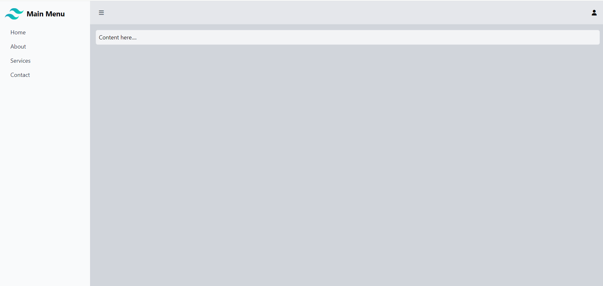

# TW-Sidebar Example

Welcome to the Tailwind CSS Sidebar Example! This project demonstrates a responsive sidebar navigation layout using HTML, CSS, and Tailwind CSS.

## Table of Contents
- Introduction
- Features
- Installation
- Usage
- Contributing
- License
- Contact

## Introduction
This project showcases a simple web page layout with a responsive sidebar using Tailwind CSS. It includes a main content area and a sidebar menu. Go to https://tailwindcss.com/docs/installation and follow the steps to get started.

## Features
- Responsive design
- Sidebar navigation with icons
- Utilizes Tailwind CSS utility classes

## Installation
1. Clone this repository to your local machine.
2. Open the `index.html` file in your web browser.

## Usage
1. Click on the sidebar menu items to navigate through different sections.
2. Customize the sidebar links, icons, and content according to your project requirements.

## Contributing
Contributions are welcome! If you find any issues or want to enhance the project, feel free to submit a pull request.

## License
This project is licensed under the MIT License.

## Contact
Feel free to check and use as your basic sidebar design:
